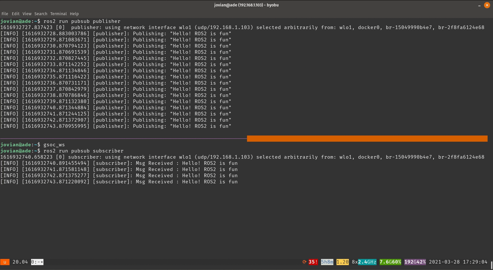

# JdeRobot ROS2 Challenge 2021

## YouTube Video
[](https://youtu.be/Y-SW9C6hEdY)

## Dependencies
Distro : ROS 2 foxy

### Install Nav2 and Turtlebot3 ros2 pkgs
```bash
sudo apt-get update
sudo apt-get install ros-${ROS_DISTRO}-rqt-*  \
    ros-${ROS_DISTRO}-navigation2 ros-${ROS_DISTRO}-nav2-bringup '~ros-${ROS_DISTRO}-turtlebot3-.*'  \
    ros-${ROS_DISTRO}-turtlebot3* -y 
```

### Environment variables for Turtlebot3
```bash
export TURTLEBOT3_MODEL=waffle
export GAZEBO_MODEL_PATH=$GAZEBO_MODEL_PATH:/opt/ros/${ROS_DISTRO}/share/turtlebot3_gazebo/models
```

### Install Gazebo for ROS2
```bash
curl -sSL http://get.gazebosim.org | sh 
sudo apt-get install ros-${ROS_DISTRO}-gazebo-ros-pkgs ros-${ROS_DISTRO}-geometry2 -y
```

### Install transforms3d
```bash
python3 -m pip install transforms3d 
```
## Setup Up ROS2 workspace
```bash
mkdir -p ~/dev_ws/src
cd ~/dev_ws/src
git clone https://github.com/Jovian-Dsouza/jderobot_ROS2_challenge

rosdep install -i --from-path . --rosdistro foxy -y
cd ~/dev_ws/ && colcon build
```

Then open another terminal and source the workspace
```bash
source ~/dev_ws/install/setup.bash
```

## ‘Hello! ROS2 is fun’


### How to use
- Publisher
```bash
source ~/dev_ws/install/setup.bash
ros2 run pubsub publisher
```

- Subscriber
```bash
source ~/dev_ws/install/setup.bash
ros2 run pubsub subscriber
```

## Visualize Amazon Warehouse Robot Sensor data

Reference: [RoboticsAcademy Link](https://jderobot.github.io/RoboticsAcademy/exercises/MobileRobots/single_robot_amazon_warehouse/)

## Navigate turtlebot3 using NAV2 

### Launch turtlebot3 simulation
```bash
ros2 launch nav2_bringup tb3_simulation_launch.py
```

### Start the waypoints action client 
```bash
source ~/dev_ws/install/setup.bash
ros2 run nav_action_client waypoints
```


